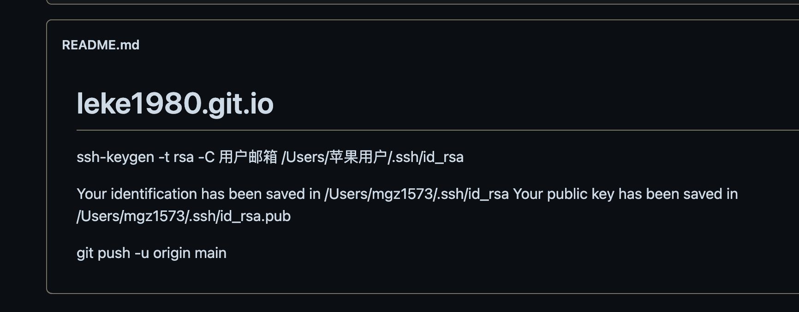

# leke1980.git.io
ssh-keygen -t rsa -C 用户邮箱
/Users/苹果用户/.ssh/id_rsa

Your identification has been saved in /Users/mgz1573/.ssh/id_rsa
Your public key has been saved in /Users/mgz1573/.ssh/id_rsa.pub

git push -u origin main

[欢迎来到我的博客](https://leke1980.github.io/)

